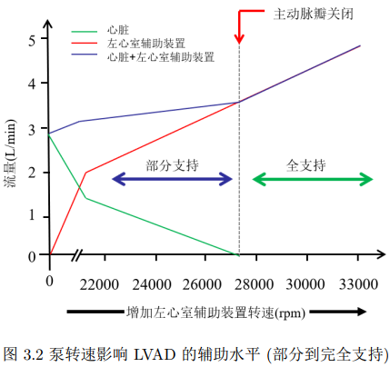

使用压力-体积（PV）环模型来描述不同临床综合征的心室功能和心肌氧供需情况。PV环提供了关于收缩功能、舒张特性、每搏输出量、心脏做功和心肌氧消耗的信息。

使用计算机仿真in-silico(Simulink)和模拟循环回路in-vitro

实验场景:静息 运动'高风险PCI、急性心肌梗死、心源性休克和急性失代偿性心力衰竭 改变体循环阻力（Rs）、心率（HR）、最大心肌弹性（Emax）和目标压力（Ptarget）等参数实现这些场景

模拟不同体型患者（瘦、正常、肥胖）

思考到底设置哪些传感器 如果设置的少可以说系统依赖于主动脉压力信号，而长期、稳定、无创地获取该信号在临床上仍是一个挑战。设置多可以设计更加复杂的奖励函数

基于临床数据集记录的LVAD流量波形，采用先进的机器和深度学习方法设计了改进的非侵入性前负荷估计器-----这也就是说根据临床流量波形数据集设计前负荷估计器 实际上人体里面是没有这个传感器的（离线学习）->要是有一个高度仿真的模拟环境可以用来收集数据 迭代数据就好了

类似heart_ctrl/RL/economic_RL 如何修改算法做到economic 降低功耗

Samsky MD, Milano CA, Pamboukian S, Slaughter MS, Birks E, Boyce S, Najjar SS, Itoh A, Reid B, Mokadam N, Aaronson KD, Pagani FD, Rogers JG. The Impact of Adverse Events on Functional Capacity and Quality of Life After HeartWare Ventricular Assist Device Implantation. ASAIO J. 2021 Oct 1;67(10):1159-1162. doi: 10.1097/MAT.0000000000001378. PMID: 33927085; PMCID: PMC8478694. https://pubmed.ncbi.nlm.nih.gov/33927085/     引用这个说明尽管CFLVADs（连续流左心室辅助装置）在技术上取得了显著进步，但患者的生活质量和不良事件仍然是CFLVAD治疗的重要限制因素(见heart_ctrl/complications/12ae.md)

对某种负面事件进行建模 比如对反流进行集总参数模型建模

传统模型通常假设心脏和血管壁是刚体，而实际上它们具有一定的弹性，这可以影响血流动力学->这里希望能够找到引用
这种简化模型通常无法模拟心脏瓣膜的动态响应，如打开和关闭速度的变化。实际上，心脏瓣膜的开合速度可以随心脏周期的不同阶段而变化，但传统模型无法反应这种特性。

整体流量仅由 PLVAD 提供，这称为全支持状态

卸载左心室可以减轻心脏的负担，有助于受损的心肌得到休息和恢
复。然而，随着时间的推移， PLVAD 患者的心脏可能会显示出改善和恢复的迹
象。这意味着心脏可能开始自行承担更多的泵血工作，不再完全依赖于 PLVAD。在这
种情况下，逐渐过渡到部分支持可能更有利，以促使心脏重新获得自身的功能 -->也就是说考虑VAD的长期使用时需要考虑这一点   思考如何说明自己的系统具有这个长期支持的功能 (比如检测到某些指标一段时间处于某一范围的时候切换成部分支持)

引用这个说明心力衰竭是全球主要致死原因之一， 影响着超过2600万人
Shahim B, Kapelios CJ, Savarese G, Lund LH. Global Public Health Burden of Heart Failure: An Updated Review. Card Fail Rev. 2023 Jul 27;9:e11. doi: 10.15420/cfr.2023.05. PMID: 37547123; PMCID: PMC10398425.
见heart_ctrl/review/hf->death.pdf

更高的电机转速会增加溶血和血栓形成等不良事件的发生概率
实验用水按1： 1： 1比例混合去离子水、 酒精和甘油
望流速被预设为2.5 L/min， 因为这是高风险PCI手术中 pVAD流量的基本要求
见1-s2.0-S0169260723005850-main.pdf(这篇文章还提到了经典的五回路电路网络引->https://ieeexplore.ieee.org/document/8067396)
Chen C, Zhang M, Hao P, He F, Zhang X. An in silico analysis of unsteady flow structures in a microaxial blood pump under a pulsating rotation speed. Comput Methods Programs Biomed. 2024 Jan;243:107919. doi: 10.1016/j.cmpb.2023.107919. Epub 2023 Nov 7. PMID: 37972458.

heart_ctrl/ml/LSTM-Transformer.pdf
本研究尚有改进空间。 例如， 脉动时间特征点仅选取了AOP上升初期的时间点， 这种选择
是为了提高计算效率和简化流程。 未来研究可考虑在单个心动周期内选取多个AOP曲线上
的特征点作为脉动时间特征点。 虽然将模型输入从单点扩展到多点会不可避免地增加计算
时间， 但随着计算硬件的进步， 这一问题将得到缓解。

手术期低血压与脑损伤和肾功能损害密切相关
Lizano-Díez I, Poteet S, Burniol-Garcia A, Cerezales M. The burden of perioperative hypertension/hypotension: A systematic review. PLoS One. 2022 Feb 9;17(2):e0263737. doi: 10.1371/journal.pone.0263737. PMID: 35139104; PMCID: PMC8827488.
见journal.pone.0263737.pdf

heart_ctrl/ml/KNN-SVM-ANN.md:基于连续的波形数据，研究使用机器学习模型来“预测”即将在未来数秒或数个心动周期内可能发生的吸引或反流事件。这将为控制器提供宝贵的决策提前量，实现从“被动响应”到“主动预防”的转变。

使用其他方法进行预测起搏点预测而非lstm-transformer ->进行波形相似度评估
使用起搏点预测指导运动速度的调整
总得来说,不基于固定时间间隔提供脉动血流 而基于预测的时间间隔提供脉动血流
或者说不是预测起搏点,而是预测搏动特征点

确定运动速度调整的精确时机。 由于运动装置与传感器之间的信号传输、 处理及响应可能存在延迟，
因此需要提前预测间隔时间。(后面的内容可引) 
临床手术中每位患者的心率各不相同， 这意味着每个心动周期的搏动特征时间点会因人而异
引
Ngan C, Zeng X, Lia T, Yin W, Kang Y. Cardiac index and heart rate as prognostic indicators for mortality in septic shock: A retrospective cohort study from the MIMIC-IV database. Heliyon. 2024 Apr 1;10(8):e28956. doi: 10.1016/j.heliyon.2024.e28956. PMID: 38655320; PMCID: PMC11035949.
见main.pdf

Chen Y, Wang M, Yang Y, Zeng M. Efficacy and Safety of Alprostadil in Microcirculatory Disturbances During Emergency PCI: A Meta-Analysis of Randomized Controlled Trials. Am J Cardiovasc Drugs. 2024 Jul;24(4):547-556. doi: 10.1007/s40256-024-00655-3. Epub 2024 Jun 8. PMID: 38850398.

此外， 患者搏动特征时间点可能因术中突发状况发生显著变化 
见INPLASY-Protocol-4638.pdf
Chen. Efficacy and safety of alprostadil in emergency PCI for improving microcirculatory disorders in patients with acute myocardial 
infarction：a meta-analysis of randomized controlled trials. Inplasy protocol 202330105. doi: 10.37766/inplasy2023.3.0105

搏动模式/反搏动模式优于连续模式 

反脉冲方法是一种用于避免左心室辅助装置泵内反流的方法。局限性在于：反脉冲方法通过在舒张期增加泵的速度来减少泵的反向流量。这种工作方式会影响到主动脉脉压的增加，可能会对心血管系统产生不利影响。要实施反脉冲方法，需要确定适当的参数设置，包括增加泵速的幅度和时机。确定这些参数可能具有挑战性，因为不同患者可能需要不同的设置，且需要考虑到个体差异和生理状况。错误的参数设置可能导致辅助效果不佳或不稳定。

在殷安云中学习血管电路模型,学习只对当前误差进行调整和对未来系统行为的预测之间的区别(怎么才算拥有预测能力呢->使用MPC(模型预测控制) >那么我能否使用MPC+RL/DL/ML/对抗学习)

左心室辅助装置控制模式影响双心室搏动同步性的数值研究 见heart_ctrl/review/sync:l-r.pdf
Wang F, Zhang Y, He W, Chen S, Jing T, Zhang Z. [Study on the synchronization of biventricular beats with the control mode of left ventricular assist device]. Sheng Wu Yi Xue Gong Cheng Xue Za Zhi. 2021 Feb 25;38(1):72-79. Chinese. doi: 10.7507/1001-5515.202001046. PMID: 33899430; PMCID: PMC10307571.
