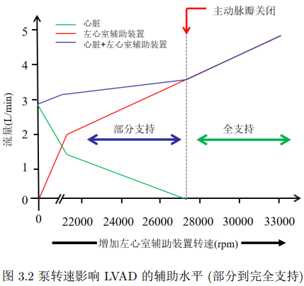

使用压力-体积（PV）环模型来描述不同临床综合征的心室功能和心肌氧供需情况。PV环提供了关于收缩功能、舒张特性、每搏输出量、心脏做功和心肌氧消耗的信息。

使用计算机仿真in-silico(Simulink)和模拟循环回路in-vitro

实验场景:静息 运动'高风险PCI、急性心肌梗死、心源性休克和急性失代偿性心力衰竭 改变体循环阻力（Rs）、心率（HR）、最大心肌弹性（Emax）和目标压力（Ptarget）等参数实现这些场景

模拟不同体型患者（瘦、正常、肥胖）

思考到底设置哪些传感器 如果设置的少可以说系统依赖于主动脉压力信号，而长期、稳定、无创地获取该信号在临床上仍是一个挑战。设置多可以设计更加复杂的奖励函数

基于临床数据集记录的LVAD流量波形，采用先进的机器和深度学习方法设计了改进的非侵入性前负荷估计器-----这也就是说根据临床流量波形数据集设计前负荷估计器 实际上人体里面是没有这个传感器的（离线学习）->要是有一个高度仿真的模拟环境可以用来收集数据 迭代数据就好了

类似heart_ctrl/RL/economic_RL 如何修改算法做到economic 降低功耗

Samsky MD, Milano CA, Pamboukian S, Slaughter MS, Birks E, Boyce S, Najjar SS, Itoh A, Reid B, Mokadam N, Aaronson KD, Pagani FD, Rogers JG. The Impact of Adverse Events on Functional Capacity and Quality of Life After HeartWare Ventricular Assist Device Implantation. ASAIO J. 2021 Oct 1;67(10):1159-1162. doi: 10.1097/MAT.0000000000001378. PMID: 33927085; PMCID: PMC8478694. https://pubmed.ncbi.nlm.nih.gov/33927085/     引用这个说明尽管CFLVADs（连续流左心室辅助装置）在技术上取得了显著进步，但患者的生活质量和不良事件仍然是CFLVAD治疗的重要限制因素(见heart_ctrl/complications/12ae.md)

对某种负面事件进行建模 比如对反流进行集总参数模型建模

传统模型通常假设心脏和血管壁是刚体，而实际上它们具有一定的弹性，这可以影响血流动力学->这里希望能够找到引用
这种简化模型通常无法模拟心脏瓣膜的动态响应，如打开和关闭速度的变化。实际上，心脏瓣膜的开合速度可以随心脏周期的不同阶段而变化，但传统模型无法反应这种特性。

整体流量仅由 PLVAD 提供，这称为全支持状态

卸载左心室可以减轻心脏的负担，有助于受损的心肌得到休息和恢
复。然而，随着时间的推移， PLVAD 患者的心脏可能会显示出改善和恢复的迹
象。这意味着心脏可能开始自行承担更多的泵血工作，不再完全依赖于 PLVAD。在这
种情况下，逐渐过渡到部分支持可能更有利，以促使心脏重新获得自身的功能 -->也就是说考虑VAD的长期使用时需要考虑这一点   思考如何说明自己的系统具有这个长期支持的功能 (比如检测到某些指标一段时间处于某一范围的时候切换成部分支持)

引用这个说明心力衰竭是全球主要致死原因之一， 影响着超过2600万人
Shahim B, Kapelios CJ, Savarese G, Lund LH. Global Public Health Burden of Heart Failure: An Updated Review. Card Fail Rev. 2023 Jul 27;9:e11. doi: 10.15420/cfr.2023.05. PMID: 37547123; PMCID: PMC10398425.
见heart_ctrl/review/hf->death.pdf

更高的电机转速会增加溶血和血栓形成等不良事件的发生概率
实验用水按1： 1： 1比例混合去离子水、 酒精和甘油
期望流速被预设为2.5 L/min， 因为这是高风险PCI手术中 pVAD流量的基本要求
见heart_ctrl/complications/high_speed_is_bad.pdf(这篇文章还提到了经典的五回路电路网络引->https://ieeexplore.ieee.org/document/8067396)
Chen C, Zhang M, Hao P, He F, Zhang X. An in silico analysis of unsteady flow structures in a microaxial blood pump under a pulsating rotation speed. Comput Methods Programs Biomed. 2024 Jan;243:107919. doi: 10.1016/j.cmpb.2023.107919. Epub 2023 Nov 7. PMID: 37972458.

heart_ctrl/ml/LSTM-Transformer.pdf
本研究尚有改进空间。 例如， 脉动时间特征点仅选取了AOP上升初期的时间点， 这种选择
是为了提高计算效率和简化流程。 未来研究可考虑在单个心动周期内选取多个AOP曲线上
的特征点作为脉动时间特征点。 虽然将模型输入从单点扩展到多点会不可避免地增加计算
时间， 但随着计算硬件的进步， 这一问题将得到缓解。

手术期低血压与脑损伤和肾功能损害密切相关 (说明VAD适用于手术期?)
Lizano-Díez I, Poteet S, Burniol-Garcia A, Cerezales M. The burden of perioperative hypertension/hypotension: A systematic review. PLoS One. 2022 Feb 9;17(2):e0263737. doi: 10.1371/journal.pone.0263737. PMID: 35139104; PMCID: PMC8827488.
见heart_ctrl/complications/surgery_period.pdf

heart_ctrl/ml/KNN-SVM-ANN.md:基于连续的波形数据，研究使用机器学习模型来“预测”即将在未来数秒或数个心动周期内可能发生的吸引或反流事件。这将为控制器提供宝贵的决策提前量，实现从“被动响应”到“主动预防”的转变。

使用其他方法进行预测起搏点预测而非lstm-transformer ->进行波形相似度评估
使用起搏点预测指导运动速度的调整
总得来说,不基于固定时间间隔提供脉动血流 而基于预测的时间间隔提供脉动血流
或者说不是预测起搏点,而是预测搏动特征点

确定运动速度调整的精确时机。 由于运动装置与传感器之间的信号传输、 处理及响应可能存在延迟，
因此需要提前预测间隔时间。(后面的内容可引) 
临床手术中每位患者的心率各不相同， 这意味着每个心动周期的搏动特征时间点会因人而异
引
Ngan C, Zeng X, Lia T, Yin W, Kang Y. Cardiac index and heart rate as prognostic indicators for mortality in septic shock: A retrospective cohort study from the MIMIC-IV database. Heliyon. 2024 Apr 1;10(8):e28956. doi: 10.1016/j.heliyon.2024.e28956. PMID: 38655320; PMCID: PMC11035949.
见heart_ctrl/feature_point/variety.pdf

Chen Y, Wang M, Yang Y, Zeng M. Efficacy and Safety of Alprostadil in Microcirculatory Disturbances During Emergency PCI: A Meta-Analysis of Randomized Controlled Trials. Am J Cardiovasc Drugs. 2024 Jul;24(4):547-556. doi: 10.1007/s40256-024-00655-3. Epub 2024 Jun 8. PMID: 38850398.

此外， 患者搏动特征时间点可能因术中突发状况发生显著变化 
见heart_ctrl/feature_point/change.pdf
Chen. Efficacy and safety of alprostadil in emergency PCI for improving microcirculatory disorders in patients with acute myocardial 
infarction：a meta-analysis of randomized controlled trials. Inplasy protocol 202330105. doi: 10.37766/inplasy2023.3.0105

搏动模式/反搏动模式优于连续模式 

反脉冲方法是一种用于避免左心室辅助装置泵内反流的方法。局限性在于：反脉冲方法通过在舒张期增加泵的速度来减少泵的反向流量。这种工作方式会影响到主动脉脉压的增加，可能会对心血管系统产生不利影响。要实施反脉冲方法，需要确定适当的参数设置，包括增加泵速的幅度和时机。确定这些参数可能具有挑战性，因为不同患者可能需要不同的设置，且需要考虑到个体差异和生理状况。错误的参数设置可能导致辅助效果不佳或不稳定。

在殷安云中学习血管电路模型,学习只对当前误差进行调整和对未来系统行为的预测之间的区别(怎么才算拥有预测能力呢->使用MPC(模型预测控制) >那么我能否使用MPC+RL/DL/ML/对抗学习)

左心室辅助装置控制模式影响双心室搏动同步性的数值研究 见heart_ctrl/review/sync:l-r.pdf
Wang F, Zhang Y, He W, Chen S, Jing T, Zhang Z. [Study on the synchronization of biventricular beats with the control mode of left ventricular assist device]. Sheng Wu Yi Xue Gong Cheng Xue Za Zhi. 2021 Feb 25;38(1):72-79. Chinese. doi: 10.7507/1001-5515.202001046. PMID: 33899430; PMCID: PMC10307571.

目前，在临床实践中，所有左心室辅助装置 (LVAD) 均在恒速设置下运行 见heart_ctrl/review/prove:v=k.pdf
Rajagopalan, N, Borlaug, B, Bailey, A. et al. Practical Guidance for Hemodynamic Assessment by Right Heart Catheterization in Management of Heart Failure. J Am Coll Cardiol HF. 2024 Jul, 12 (7) 1141–1156.
https://doi.org/10.1016/j.jchf.2024.03.020

控制策略输入的两种思路:对生理状态进行估计,有创测量

看看非pvad的方式 也就是较大型的vad

看看与心血管领域的控制条件类似的其他领域的算法->深度学习之类的 对抗学习到底是什么

通过舒张末期的运动电流和主动脉压来测定 LVEDP->主动脉压是vad的设备信号吗 还是说其实这是vad出口压强

在连续动作空间中做RL实现优化控制 此时可以与离散工作空间相对比 说明连续动作空间的好处

离线RL与临床数据利用： 充分利用日益增长的VAD患者临床数据库。通过离线RL技术，从这些真实世界数据中预训练或微调控制策略，有望显著缩小模拟-现实鸿沟，并为控制器个性化提供数据基础。

不确定性感知RL： 开发能够量化和管理不确定性的RL算法。控制器应能识别出何时其面临的生理状态超出了其训练数据的范围（即高认知不确定性），并在此情况下自动切换到更保守、更安全的控制模式。感知不确定的目的是为了安全

该研究提出了一种新颖的、基于模型的安全RL算法ACTSAFE，用于实现安全且高效的探索。该算法学习一个感知不确定性的动态模型，并利用这个模型来隐式地定义和扩展“安全策略集”。其关键思想是在规划时对认知不确定性持“乐观”态度以鼓励探索，同时对安全约束持“悲观”态度以确保安全。
ACTSAFE维持一组悲观的策略集，并在此集合内乐观地选择产生具有最大模型认知不确定性的轨迹的策略。
As, Y., Sukhija, B., Treven, L., Sferrazza, C., Coros, S., & Krause, A. (2024). ActSafe: Active Exploration with Safety Constraints for Reinforcement Learning. arXiv. https://arxiv.org/abs/2410.09486
见heart_ctrl/RL/ACTSAFE.pdf

该研究专注于安全攸关领域的离线强化学习。它通过一个模型集成（model ensemble）来量化认知不确定性。其核心论点是，一个对认知不确定性风险规避的策略，能够自然地缓解离线学习中的分布偏移问题。通过惩罚那些预测结果具有高可变性的动作，智能体被激励去避免进入数据覆盖不足（即高认知不确定性）的状态区域。
见heart_ctrl/RL/safe_offline.pdf
Rigter, M., Lacerda, B., & Hawes, N. (2023). One Risk to Rule Them All: A Risk-Sensitive Perspective on Model-Based Offline Reinforcement Learning. In A. Oh, T. Naumann, A. Globerson, K. Saenko, M. Hardt, & S. Levine (Eds.), Advances in Neural Information Processing Systems(Vol. 36, pp. 77520–77545). Curran Associates, Inc.

一个思路：先使用CNN来估计前负荷 然后将估计的前负荷作为输入进控制器中 得到泵速->也就是说我需要思考如何估计前负荷->使用离线强化学习

阐述安全的强化学习策略为什么安全时 不仅仅是变化的很剧烈的时候进行惩罚 而是没有训练到的输入进行预测 预测到了的话就采取保守策略 因为可能从结果上来看变化并不剧烈的结果也是不对的 不仅仅是变化剧烈的结果不对->如何衡量某个输入是不在学习到的数据范围内的?

对抗环境生成器的输入是网络的中间激活输出和控制器迭代一轮的所有环境状态

Actor-Critic: Actor用于给出动作,对于这个动作,根据奖励函数,会给出一个客观的奖励,由于奖励函数的特性,只针对一个时间点的输入给出输出,所以这个奖励是即时的,所以加入一个Critic模型,对状态进行打分,用于预测从长远看来某一个状态的的分数,这样可以增强系统的鲁棒性,再引入一个时序差分误差=下一状态的价值+当前状态的奖励-当前状态的价值,理想状态下,这个值应该是零,如果为正的话,代表Critic模型对当前状态的估值过低,就增加估值,反之亦然。对于Actor模型来说，利用时序差分误差的方式是：如果时序差分误差为正，代表这个动作是超出预期的好，所以就增大生成这个动作的概率

“状态表示”成为新焦点
通过综合分析，我发现了一个之前计划中未充分强调的关键问题：“状态表示学习”（State Representation Learning）。算法的性能不仅取决于其决策逻辑（策略），还严重依赖于它如何“感知”患者的当前状态。研究表明，简单地使用原始生理信号（如压力或流量）可能不是最优的。因此，我新增了一个研究方向，将专门探索如何将复杂的传感器数据（如心室舒张末期压力、脉搏指数 PI 或通过电子病历推断的状态）提炼为紧凑而信息丰富的“状态”向量，供 Actor-Critic 算法使用。
使用embedding模型将生理状态转化为高维空间向量，侧重点是紧凑而信息丰富

第二条路径是更前沿的“端到端”方法。与其依赖专家知识手动提取特征，不如使用“状态表示学习 (SRL)”技术，例如变分自编码器 (VAE)。这种方法将高维的原始传感器数据（如完整的左心室压力波形）输入到一个自动编码器中，由其“学习”到一个低维度的、信息密集的“抽象状态”向量。这个向量随后被用作 Actor-Critic 算法的输入。这代表了一种更自动化、但可解释性较差的先进策略。

约束策略优化 (CPO)： CPO是一种信赖域（trust region）算法，它在优化目标的同时，显式地将约束作为优化问题的一部分 57。CPO是“第一个为约束RL提供每次迭代（at each iteration）近约束满足保证（near-constraint satisfaction）的通用策略搜索算法”57。这意味着我们可以定义一个成本函数，并命令CPO在硬约束下最大化奖励。
见heart_ctrl/RL/CPO.pdf

对抗强化学习: heart_ctrl/RL/RARL.pdf heart_ctrl/RL/RARLBRC.pdf

使用血液动力学门控Conformer (HGC-Transformer) 最终决定了

近期（两篇）研究表明，卷积和自注意力机制的结合优于单独使用二者
第一篇
I. Bello, B. Zoph, A. Vaswani, J. Shlens, and Q. V. Le, “Attention augmented convolutional networks,” in Proceedings of the IEEE International Conference on Computer Vision, 2019, pp. 3286–3295.
第二篇
Z. Wu, Z. Liu, J. Lin, Y. Lin, and S. Han, “Lite transformer with long-short range attention,” arXiv preprint arXiv:2004.11886, 2020.

在实验的部分综合两个领域的习惯做实验