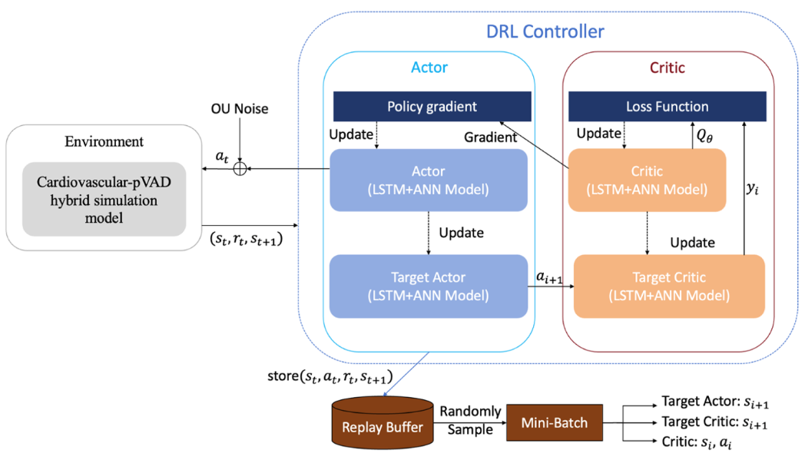
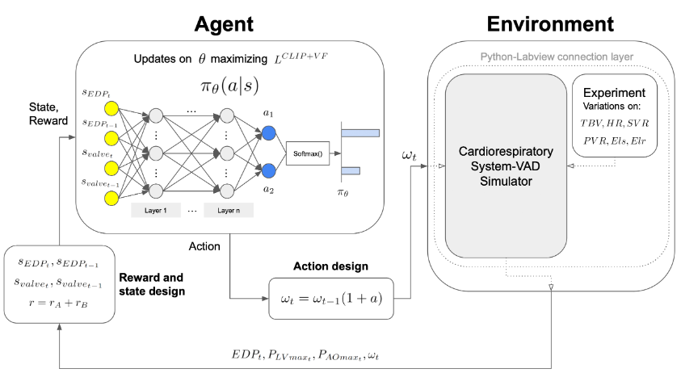
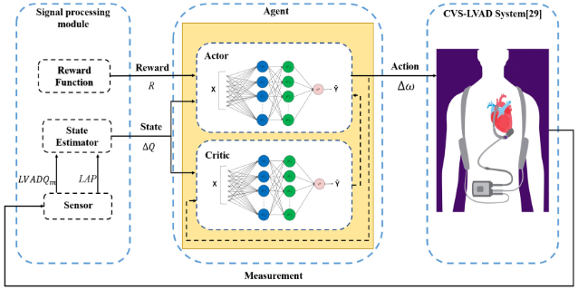

# VAD控制的 强化学习（RL） 技术方案调研

目录

## 为什么是RL?

### 恒速控制 (Constant Speed)

*   **工作方式:** VAD以一个固定的速度持续运转。
*   **优点:**
    *   最简单、最可靠。
*   **缺点:**
    *   **无法适应生理变化:** 无法根据患者活动、情绪或病情变化（如运动、休息、体位改变）自动调整，可能导致辅助不足或过度。
    *   **生理不友好:** 恒定的血流破坏了天然的脉动性，可能引发多种并发症。

### 传统控制 (如 PI 控制器)

*   **工作方式:** 基于简化的数学模型，通过反馈控制（如测量左心室压力）来调整泵速。
*   **优点:**
    *   具备一定的自适应能力，比恒速控制更优。
    *   原理清晰，易于实现和验证。
*   **缺点:**
    *   **模型依赖性强:** 性能高度依赖于预先建立的、简化的数学模型。当人体这一复杂、非线性的系统动态偏离模型时，控制效果会显著下降。
    *   **单目标优化:** 通常只关注一个或少数几个生理指标，难以在多个相互冲突的目标（如充分卸载、维持脉动、避免抽吸）之间取得平衡。
    - **适应性有限:** 无法从经验中学习和优化，对于模型未覆盖的未知情况，鲁棒性差。

### 强化学习 (Reinforcement Learning)

*   **工作方式:** AI智能体（控制器）通过与环境（患者循环系统）的实时交互来“学习”最优控制策略。它不断尝试不同的泵速，并根据获得的“奖励”（代表治疗效果的好坏）来调整自己的决策。
*   **优点:**
    *   **高度自适应和个性化:** 无需精确的数学模型，能直接从数据中学习，适应每个病人独特的、随时间变化的生理状况。
    *   **多目标优化能力:** 奖励函数可以被设计得非常复杂，能够同时兼顾血流动力学稳定、脉动性恢复、安全性（避免不良事件）等多个目标，找到全局最优解。
    *   **处理复杂动态:** 能够利用深度学习模型从高维、时序的传感器数据（如压力/流量波形）中提取深层特征，做出更精准的决策。
*   **挑战:** 训练过程复杂，需要高质量的仿真环境或数据。
从创新点的角度，RL的模型架构，数据pipeline，奖励函数设计都可做文章。

## 文献对比分析(近三年)
这3篇的控制策略都围绕血流动力学生理指标和VAD相关的不良事件展开，但是具体关注点有所不同。
1. Enhancing cardiac hemodynamic and pulsatility in heart failure via deep reinforcement learning: An in-silico and in-vitro validation study of percutaneous ventricular assist devices
2. Physiological control for left ventricular assist devices based on deep reinforcement learning

3. Intelligent and strong robust CVS-LVAD control based on soft-actor-critic algorithm

### **血流动力学生理指标**

- **前负荷 (Preload):**
  舒张末期，心室所承受的容量负荷或压力。通常用左室舒张末期压作为左心室前负荷的指标，用右心室舒张末期压作为右心室的前负荷。

- **左心室压 (Left Ventricular Pressure, LVP):**
  指左心室内部的压力。LVP在心动周期中不断变化，其波形和数值（如收缩压、舒张末期压力）是评估心室功能的核心。

- **舒张末期容积 (End-Diastolic Volume, EDV):**
  指心室在舒张期结束，即完成血液充盈并准备收缩前的最大容积。它是评估心脏泵功能的另一个关键前负荷指标。

- **左心室收缩压 (Left Ventricular Systolic Pressure, LVSP):**
  指左心室在收缩期能达到的最高压力。在VAD控制中，LVSP可以作为一个控制目标，以确保最佳的左心室卸载程度。

---

- **左心室舒张末期压 (Left Ventricular End-Diastolic Pressure, LVEDP):**
  它指左心室在舒张期结束（即充盈完成，即将收缩）时的内部压力。维持适当的LVEDP是VAD控制的关键目标之一。

- **脉压差 (Pulse Pressure):**
  收缩压（高压）与舒张压（低压）之间的差值。它是`衡量脉动性强弱的直接指标`。脉压差过小意味着血流接近于非脉动的连续流。

- **主动脉压 (Aortic Pressure, AOP):**
  指主动脉内的血压，同样随着心动周期而波动。它是维持全身血液灌注的驱动力，也是VAD控制器需要监测和维持的关键参数。

- **主动脉流量 (Aortic Flow):**
  指单位时间内流经主动脉的血量。它直接反映了心脏（或VAD）向全身泵送血液的效率。

### **VAD相关的不良事件**
这些不良事件就是在控制方案设计时需要重点关注和解决的因素

- **抽吸 (Suction):**
  当VAD的泵速设置得相对于前负荷过高时，泵会“过度抽吸”，导致心室壁被吸向泵的入口导管，引起心室塌陷。这是一种危险状况，会损伤心肌并导致血流中断。进而导致心室塌陷，即心室的腔体因内外压力失衡而塌陷关闭。

- **反流 (Reflux / Backflow):**
  在VAD泵速过低或停机时，泵可能无法产生足够压力将血液推向主动脉，反而成为左心室和主动脉之间的一个开放通道，导致血液从压力较高的主动脉倒流回左心室，降低了VAD的辅助效率。

- **溶血 (Hemolysis):**
  指红细胞被破坏，其内容物（血红蛋白）释放到血浆中的现象。在VAD中，血液高速流经泵时产生的巨大剪切应力是导致溶血的主要原因。

---

- **主动脉瓣持续关闭 (Prolonged Aortic Valve Closure):**
  当VAD泵速过高，持续吸走左心室的血液时，左心室压力可能始终无法升高到足以推开主动脉瓣的水平，导致主动脉瓣持续关闭，血液完全依赖VAD。即使VAD让大部分血液“一直在流动”，但由于主动脉瓣关闭，主动脉根部的局部血流停滞，再加上VAD本身带来的血管内皮损伤和血液高凝状态，这三个因素共同作用，使得血栓形成的风险大大增加。为了对抗这种风险，临床上植入VAD的患者都需要服用抗凝药物和抗血小板药物。

- **剪切应力 (Shear Stress):**
  流体力学概念，指流体（血液）在流动时，内部不同流速的流层之间以及流体与血管壁/泵壁之间产生的摩擦力。过高的剪切应力会像撕裂一样破坏血细胞。泵速剧烈变化时剪切应力可能会变大。

### 方法论
主要分析输入输出和奖励函数，暂时不关注模型内部细节和模型训练方法

### 方法论 (1): DDPG-LSTM

#### 输入
| 输入信号 (State) | 符号 | 描述 |
| :--- | :--- | :--- |
| 主动脉压力波形 | `PAOP(t-Δt:t)` | 过去50个时间点的主动脉压力(AOP)序列 |
| 主动脉流量波形 | `PAF(t-Δt:t)` | 过去50个时间点的主动脉流量(AF)序列 |
| 心率 | `HR(t)` | 当前的实时心率 |
| 左心室压力 | `LVP(t)` | 当前的左心室压力 |
| 泵流量 | `Qpump(t)` | 当前的泵流量 |
#### 输出
| 输出动作 (Action) | 范围 | 描述 |
| :--- | :--- | :--- |
| pVAD电机转速 | `[20000, 34000]` | pVAD电机的目标转速(rpm) |

#### 奖励函数
本文的奖励函数是一个混合多目标函数，由三个核心部分组成：

-   **R1 (血液动力学稳定性):**
    该部分用于激励智能体维持平均动脉压 (MAP) 和心输出量 (CO) 在目标范围内。它使用指数衰减函数来构造奖励，使得在远离目标值时梯度更大，从而加速收敛。

-   **R2 (脉动波形相似性):**
    为了使辅助后的主动脉压力 (AOP) 和主动脉流量 (AF) 波形接近健康人的生理状态，该部分使用动态时间规整 (DTW) 算法来计算当前波形与健康参考波形之间的相似度。DTW 算法能够有效处理相位延迟问题，比传统的均方误差 (MSE) 更适合波形比较。

-   **R3 (控制稳定性和安全性惩罚):**
    这是一个惩罚项，包含两方面：
    -   **Rrpm:** 对泵速的剧烈变化进行惩罚，以保证控制的平滑和稳定。
    -   **RLVEDP:** 当左心室舒张末期压力 (LVEDP) 低于 5 mmHg 的安全阈值时，施加一个巨大的惩罚，以防止发生心室抽吸（suction）。

### 方法论 (2): PPO

#### 输入
| 输入信号 (State) | 符号 | 描述 |
| :--- | :--- | :--- |
| 当前EDP偏差 | `SEDP_t` | 当前心动周期的舒张末期压力(EDP)与参考EDP之差 |
| 上一周期EDP偏差 | `SEDP_{t-1}` | 上一心动周期的舒张末期压力(EDP)与参考EDP之差 |
| 当前收缩压差 | `Svalve_t` | 当前心动周期的左心室最大压力与主动脉最大压力之差 |
| 上一周期收缩压差 | `Svalve_{t-1}`| 上一心动周期的左心室最大压力与主动脉最大压力之差 |
#### 输出
| 输出动作 (Action) | 值 | 描述 |
| :--- | :--- | :--- |
| 泵速调整因子 | `+0.01` | 增加LVAD转速 |
| 泵速调整因子 | `-0.01` | 减小LVAD转速 |

#### 奖励函数
奖励函数由两部分组成 (`r = rA + rB`)，旨在`鼓励主动脉瓣开放和保持适度的左心室前负荷`。

-   **`rA` (维持前负荷稳定):**
    这部分奖励旨在根据舒张末期压力 (EDP) 与目标值的偏差 (`SEDP`) 调整泵速。
    -   当 `SEDP` 和泵速调整方向 `a` 的乘积为正（即高前负荷时增速，低前负荷时降速），`rA = 1`。
    -   当乘积为负时，`rA = -2`，以示惩罚。

---

-   **`rB` (促进主动脉瓣开放):**
    这部分奖励旨在通过调整泵速以促进主动脉瓣开放。该部分基于收缩期左心室与主动脉之间的最大压力差 `Svalve`。
    -   当 `Svalve` 和泵速调整方向 `a` 的乘积为正，`rB = 1`。
    -   当乘积为负时，`rB = 0`。

最终的奖励函数 `r = rA + rB` 更侧重于维持前负荷稳定（`rA` 的惩罚项更大）。

### 方法论 (3): SAC

#### 输入输出
| 输入信号 (State) | 符号 | 描述 |
| :--- | :--- | :--- |
| 流量偏差 | `ΔQ` | 估计所需泵血流量（LVADQe）与实际测量平均泵血流量（LVADQm）之差 |

| 输出动作 (Action) | 符号 | 描述 |
| :--- | :--- | :--- |
| 泵速调整量 | `Δω` | LVAD泵的转速调整量 |

#### 奖励函数
奖励函数 `r(st, at)` 被设计用来激励智能体尽快消除流量偏差 `ΔQ`。它由两部分组成：

- **主要部分:** `|ΔQ| * β`，其中 `β` 是一个负的归一化因子（-0.02）。这部分是一个惩罚项，`ΔQ` 越大，惩罚越大，从而驱使智能体减小流量偏差。

- **目标奖励 (rtarget):** 这是一个分段函数。
    - 当 `|ΔQ|` 小于3时，给予一个0.5的固定正奖励，以鼓励控制器将偏差维持在一个较小的范围内，并加速收敛。
    - 当 `|ΔQ|` 大于等于3时，奖励为0。

这个设计旨在通过惩罚大偏差和奖励小偏差来快速稳定控制系统。

## 思考
一些模型设计方面的权衡和比较

### 关注哪些输入指标？
- 如果关注过往一段时间的动态指标，使用什么模型处理动态指标?
  - LSTM?
  - transformer?
  - decode-only?

### 使用泵速还是泵速变化量作为输出？

*   **输出绝对泵速 (如 DDPG-LSTM):**
    *   **优点:** 响应直接、迅速。
    *   **缺点:** 易造成泵速剧烈跳变，产生高剪切应力（溶血风险），必须在奖励函数中加入惩罚项来保证平滑性。

*   **输出泵速变化量 (如 PPO, SAC):**
    *   **优点:** 控制过程**内在平滑**，更安全、稳定，对血液友好。
    *   **缺点:** 响应相对较慢，需要多次迭代才能完成大幅度调整。

#### 如何设计奖励函数？

奖励函数的设计，本质上是**将临床目标转化为数学公式**。这需要在 **“简单以保证收敛”** 和 **“复杂以保证临床效果”** 之间做出权衡。

---

##### 1. 简单奖励函数

*   **设计哲学：** 抓住最核心的1-2个控制目标。
*   **优点:**
    *   收敛快，易于学习，可解释性强。
*   **缺点:**
    *   **“隧道视野”:** 可能为了优化单一指标而引发其他不良事件（如为降低`ΔQ`而剧烈变速导致溶血）。
    *   **忽略其他重要目标:** 未考虑脉动性，控制效果不全面。

---

##### 2. 复杂奖励函数

*   **设计哲学：** 将多个临床目标融合到一个函数中。
*   **优点 (说服力强):**
    *   **临床目标全面:** 更接近真实世界需求，理论上能训练出更“懂医学”的控制器。
    *   **策略更鲁棒:** 明确的惩罚项可以“堵住”模型走向危险策略的路径。
*   **缺点 (难以收敛):**
    *   **目标冲突与平衡难题:** 如何设定各子项的权重是一门艺术。（超参数过于多）
    *   **学习效率低下:** 奖励信号复杂，模型可能收敛慢或不收敛。

一个有说服力的控制器，其奖励函数必然是经过精心设计和平衡的复杂函数。

