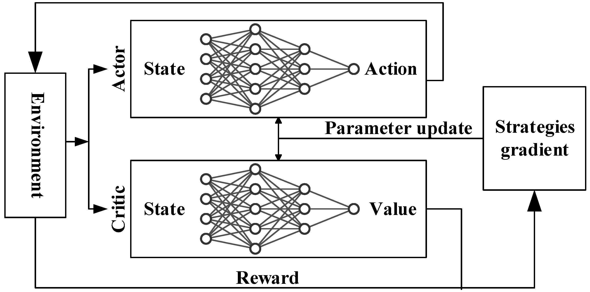
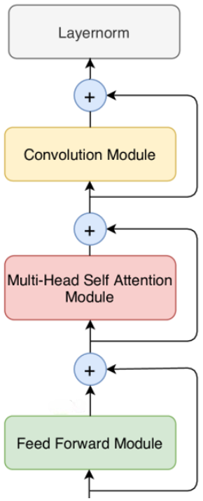
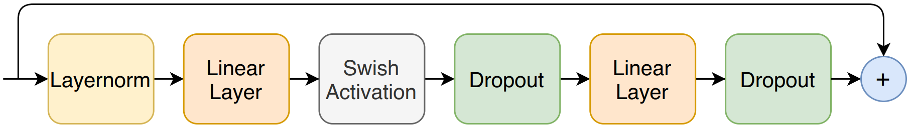
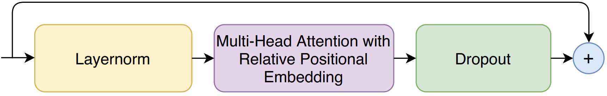
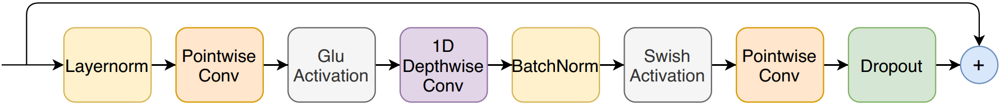

# 动作网络和价值网络的具体结构

离线强化学习：采集大量环境数据，根据环境数据学习策略
在线强化学习：采集一轮环境数据，根据环境数据学习到新的策略，使用新的策略与环境交互生成新一轮环境数据，使用新一轮的数据学习策略...

使用改进的架构（RLVR：强化学习与可验证奖励）VS使用经典的actor-critic架构

既然是拿来用，那么就采用经典的久经验证的

---

## 研究现状

LSTM 长短期记忆网络
FCNN 全连接神经网络

### LSTM
专门用于处理序列数据
无法并行计算，响应很慢；与之相对应的是Transformer，用于处理序列数据，可以并行计算。

### Transformer
擅长捕捉长距离依赖关系，但是对于局部特征的理解不足。

## 心脏相关生理信号特点

**局部特征**
1. 主动脉和左心室压力的收缩末期值、舒张末期值。用于判断心脏当前状态（是否发生抽吸、瓣膜是否开启）。
2. 剧烈的生理状态变化过程，比如咳嗽。
3. 偶发性的心律失常

**长距离依赖**
缓慢的生理状态变化过程：从运动状态到休息状态的切换。Agent 需要记住过去数十个心动周期的趋势，才能判断当前的压力下降是暂时的噪点，还是持续性低速灌注的开始。

**结论**
只有Transformer不够，还需要一个能够捕捉局部特征的模型——CNN

## CNN
CNN根据卷积核维度的不同分为1D CNN，2D CNN，3D CNN
分别可以用来处理1维（时间序列数据：AoP、LVP、CO），2维（图像）和3维（视频）数据

## CNN-Transformer

 

CNN-Transformer由三个模块堆叠而成：前馈模块、自注意力模块、卷积模块。

### 前馈模块

### 自注意力模块

### 卷积模块

